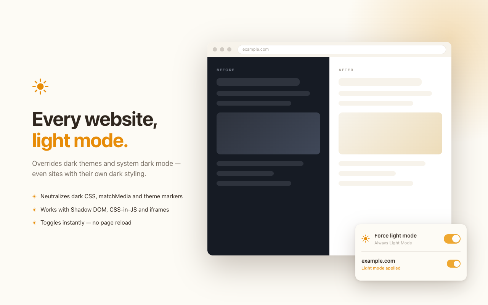

# Always Light Mode

> Every website, light mode. ☀️

[](https://chromewebstore.google.com/detail/always-light-mode/njnammmpdodmfkodnfpammnpdcbhnlcm)
[](https://chromewebstore.google.com/detail/always-light-mode/njnammmpdodmfkodnfpammnpdcbhnlcm)
[](https://github.com/chen86860/always-light-mode/actions/workflows/ci.yml)

A browser extension that forces every website into light mode — overriding dark themes and system dark mode, even on sites that ship their own dark styling.

## Install

Get it from the Chrome Web Store — one click, no configuration needed:

<a href="https://chromewebstore.google.com/detail/always-light-mode/njnammmpdodmfkodnfpammnpdcbhnlcm"></a>

Also works on Edge, Brave, Arc and other Chromium-based browsers — install from the same link. Firefox users can build from source (see [Development](#development)).



## Why

Most "light mode" extensions only override your system preference, which does nothing on sites that decide their theme themselves. Always Light Mode neutralizes dark styling at every layer:

- **Dark CSS rules** — `@media (prefers-color-scheme: dark)` blocks are neutralized, including those nested in `@import`, `@layer`, `@supports` and `@container`
- **JavaScript theme detection** — `window.matchMedia` is patched synchronously in the page's MAIN world at `document_start`, before any page script (anti-flicker scripts see "light" too)
- **Theme markers** — `class="dark"`, `data-theme`, `data-color-mode` (GitHub), `data-bs-theme` (Bootstrap) and friends are rewritten to light
- **Modern sites** — open Shadow DOM, constructed stylesheets (CSS-in-JS) and iframes are all covered
- **Instant toggling** — switches apply and revert live on open pages, no reload (rules are rewritten reversibly, not deleted)

## Usage

Click the toolbar icon to open the control panel:

- **Master switch** — turn light mode on/off everywhere
- **Site switch** — exclude the current site with one click if it looks better untouched
- **Email feedback** — report a stubborn site straight from the panel

Settings sync through your browser account (`storage.sync`). No tracking, no analytics, no data collection.

## Development

```sh
pnpm install
pnpm dev              # dev mode with HMR (Chrome)
pnpm dev:firefox      # dev mode (Firefox)
pnpm compile          # typecheck
pnpm build            # production build → .output/chrome-mv3
pnpm test:e2e         # build + Playwright E2E suite
pnpm zip              # build + package for the store
pnpm store:assets     # regenerate store screenshots/promo tile
```

Built with [WXT](https://wxt.dev) + TypeScript. No runtime framework — the popup is vanilla TS/CSS, a few KB total.

### How it works

Two content scripts are **registered dynamically** by the background (`scripting.registerContentScripts`), so the enabled state and per-site exclusions are baked into the registration — pages never race an async storage read:

| File                            | World    | Role                                                                                                              |
| ------------------------------- | -------- | ----------------------------------------------------------------------------------------------------------------- |
| `entrypoints/inject.content.ts` | MAIN     | Patches `matchMedia`, `CSSStyleSheet.replace/insertRule`, `attachShadow` before page scripts run                  |
| `entrypoints/content.ts`        | ISOLATED | Neutralizes dark CSS/theme markers, observes DOM/style/shadow-root changes, live enable/disable via storage watch |
| `entrypoints/background.ts`     | —        | Syncs registrations and the toolbar icon                                                                          |
| `entrypoints/popup/`            | —        | Control panel                                                                                                     |

### Testing

`tests/e2e/` runs against the built extension in headless Chromium (Playwright): forced-light coverage on a hostile dark page, live-toggle round-trips without navigation, popup state machine and feedback mailto. CI (`.github/workflows/ci.yml`) runs typecheck + both builds + E2E on every push/PR.

## Releasing

Push a `v*` tag and `.github/workflows/release.yml` builds, zips and submits to the Chrome Web Store (API v2, service account auth). See [docs/publishing.md](docs/publishing.md) for the one-time credential setup, [docs/store-listing.md](docs/store-listing.md) for listing copy (10 locales) and [docs/permission-justifications.md](docs/permission-justifications.md) for review notes.

## Known limitations

- Closed shadow roots can't be reached from content scripts
- Sites themed purely via `matchMedia` JavaScript keep their light theme after a live toggle-off until reloaded (CSS-based theming reverts instantly)
- On Firefox, the MAIN-world patch requires Firefox 128+; older versions fall back to CSS handling only
